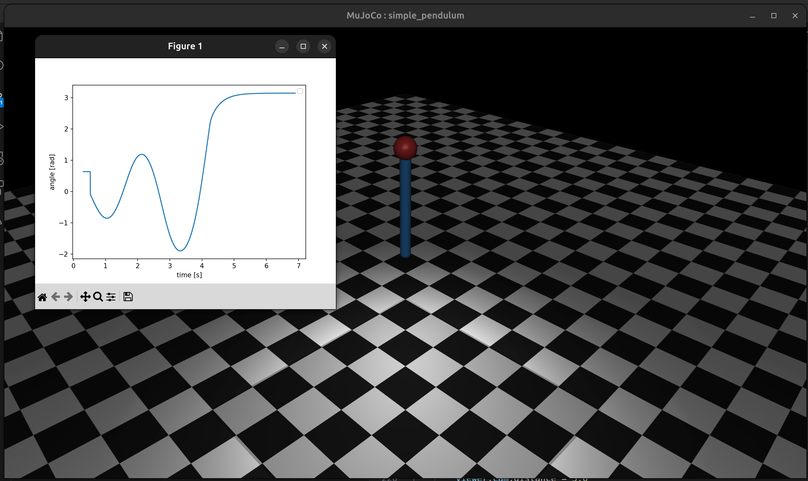
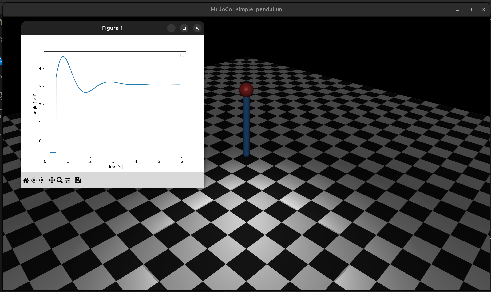

# Control with MuJoCo

### Simple Pendulum "Swing up and Balance"

Demonstrates PD control as well as an energy shaping strategy/LQR to keep a pendulum inverted in MuJoCo.

```
pip install -e .[dev]
python src/simple_pendulum/pendulum.py <lqr or pd>
```


